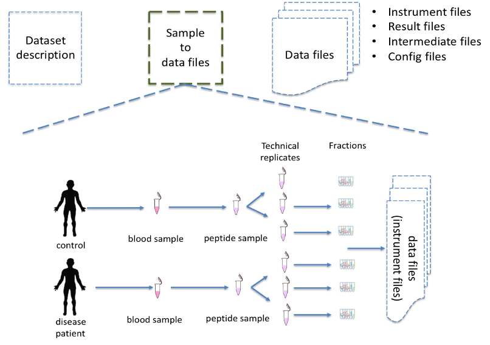

Many resources have emerged that provide raw or integrated proteomics data in the public domain. If these are valuable individually, their integration through re-analysis represents a huge asset for the community [1]. Unfortunately, proteomics experimental design and sample related information are often missing in public repositories or stored in very diverse ways and formats. For example, the CPTAC consortium (https://cptac-data-portal.georgetown.edu/) provides for every dataset a set of excel files with the information on each sample (e.g. https://cptac-data-portal.georgetown.edu/study-summary/S048) including tumor size, origin, but also how every sample is related to a specific raw file (e.g. instrument configuration parameters). As a resource routinely re-analysing public datasets, ProteomicsDB, captures for each sample in the database a minimum number of properties to describe the sample and the related experimental protocol such as tissue, digestion method and instrument (e.g. https://www.proteomicsdb.org/#projects/4267/6228). Such heterogeneity often prevents data interpretation, reproducibility, and integration of data from different resources. This is why we propose a homogenous standard for proteomics metadata annotation. For every proteomics dataset we propose to capture at least three levels of metadata: (i) dataset description, (ii) the sample and data files related information; and (iii) the technical/proteomics specific information in standard data file formats (e.g. the PSI formats mzIdentML, mzML, or mzTab, among others).

The general description includes minimum information to describe the study overall: title, description, date of publication, type of experiment (e.g. http://proteomecentral.proteomexchange.org/cgi/GetDataset?ID=PXD016060.0-1&outputMode=XML). The standard data files contain mostly the technical metadata associated with the dataset including search engine settings, scores, workflows, configuration files, but do not include information about the sample metadata and/or the experimental design. Currently, all ProteomeXchange partners mandate this information for each dataset. However, the information regarding the sample and its relation to the data files (**Figure 1**) is mostly missing [1].

These three levels of metadata are combined in the well-established data formats ISA-TAB [2] (https://www.isacommons.org/) or MAGE-TAB [3], which are used in other omics fields such as metabolomics and transcriptomics. In both data formats, a tab-delimited file is used to annotate the sample metadata and link it to the corresponding data file(s) (sample and data relationship file format - SDRF). Both data formats encode the properties and sample attributes as columns, and each row represents a sample in the study. However, more important that the file-format itself, general guidelines about what information should be encoded to enable reproducibility of the proteomics results is needed. The lack of guidelines to annotate information such as disease stage, cell line code, or organism part, or the analytical information about labelling channels (e.g. TMT, SILAC) makes the data representation incomplete. The consequence is that it is not possible to understand the original experiment, and/or perform a re-analysis of the dataset having all the necessary information for reproducibility purposes. If the information about the fractions, labelling channels, or enrichment methods is not annotated, the reuse and reproduction of the original results will be challenging, if possible, at all.

**Figure 1**: SDRF-Proteomics file format stores the information of the sample and its relation to the data files in the dataset. The file format includes not only information about the sample but also about how the data was acquired and processed.
